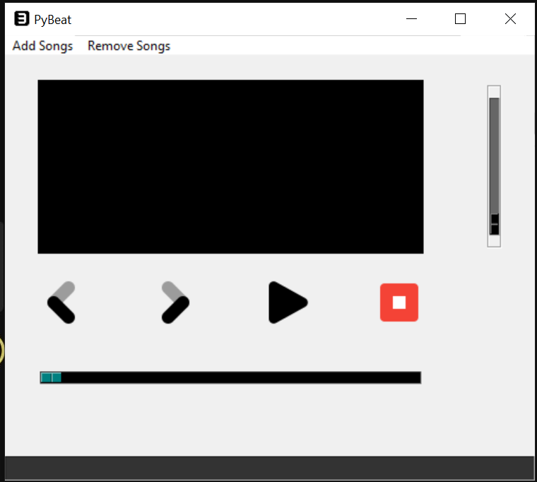
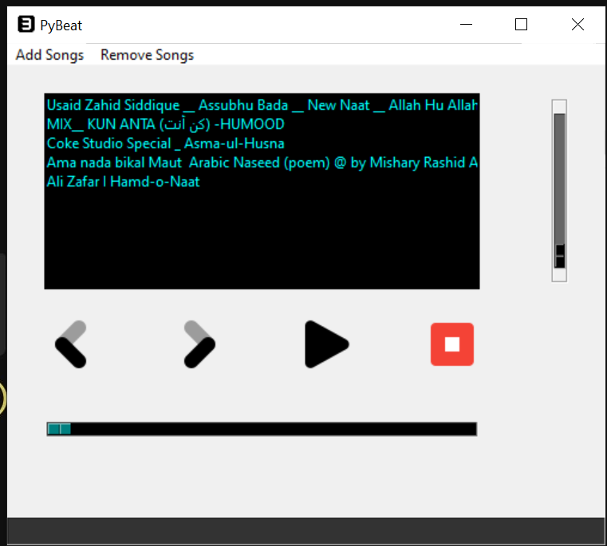
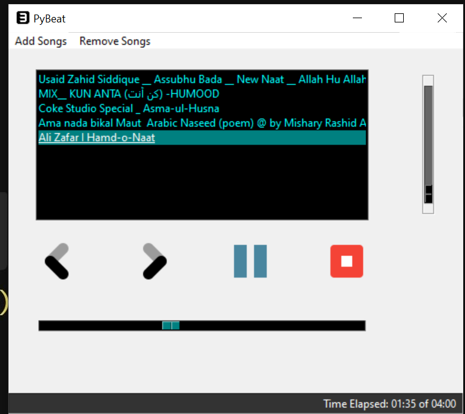

# Mp3-player-tkinter
Welcome to the MP3 Player repository! This project offers a simple yet functional MP3 player implemented using Python's Tkinter library, allowing users to play their favorite music seamlessly.

Overview
This project presents a user-friendly MP3 player interface built with Tkinter, a standard GUI toolkit for Python. The design focuses on simplicity and ease of use, enabling users to navigate through their music library effortlessly.

Features
1 Add Music: Easily add your favorite MP3 files to the player's library.
2 Delete Music: Remove unwanted songs from the library.
3 Adjust Volume: Control the volume level to suit your preferences.
4 Play Next Music: Move to the next song in the playlist.
5 Stop Music: Stop the current song playback.
6 Pause or Play Music: Pause or resume playback at any time.

How to Use
To use the MP3 Player , follow these simple steps:

Clone the Repository: Begin by cloning this repository to your local machine using the following command:
bash
Copy code
[git clone https://github.com/your-username/mp3-player-tkinter.git]

Install Dependencies: Ensure you have Python installed on your system. Additionally, install the necessary dependencies by running:
bash
Copy code
pip install -r requirements.txt
Run the Application: Navigate to the project directory and execute the following command to launch the MP3 player:
bash
Copy code
python mp3_player.py
Enjoy Your Music: Once the application is running, you can load your MP3 files, play, pause, stop, adjust the volume, and navigate through your playlist with ease.

Contributions
Contributions are welcomed to enhance the MP3 player further. If you have any suggestions, bug fixes, or new features to introduce, feel free to create a pull request. Please ensure your contributions align with the project's goals and adhere to best practices.

Credits
This MP3 Player application draws inspiration from various online tutorials and resources on Python GUI development with Tkinter.

License
The "MP3 Player Application with Tkinter" repository is open-source and licensed under the GNU License. You are free to use, modify, and distribute the code according to the terms of the license.

